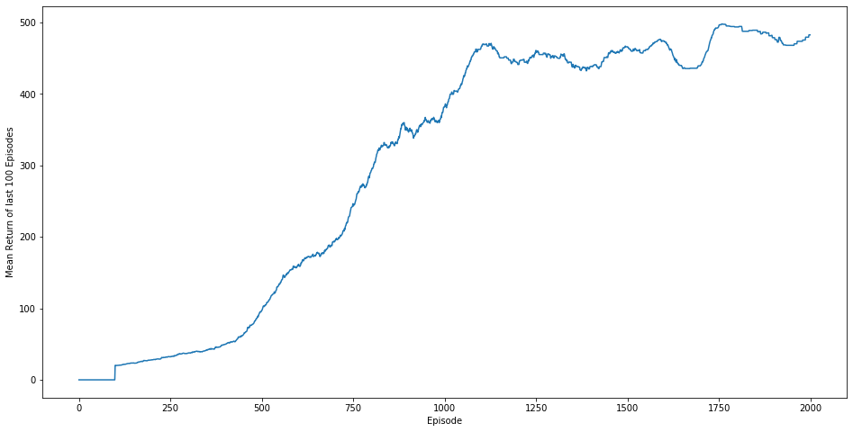

# Reinforce From Scratch

A first attempt at implementing REINFORCE algorithm...

Output:  
Epoch = 100 | 100-mean Episode length = 19.729999542236328  
Epoch = 200 | 100-mean Episode length = 28.110000610351562  
Epoch = 300 | 100-mean Episode length = 37.58000183105469  
Epoch = 400 | 100-mean Episode length = 49.83000183105469  
Epoch = 500 | 100-mean Episode length = 96.94000244140625  
Epoch = 600 | 100-mean Episode length = 161.5500030517578  
Epoch = 700 | 100-mean Episode length = 193.8800048828125  
Epoch = 800 | 100-mean Episode length = 293.1199951171875  
Epoch = 900 | 100-mean Episode length = 349.2799987792969  
Epoch = 1000 | 100-mean Episode length = 381.9700012207031  
Epoch = 1100 | 100-mean Episode length = 465.7900085449219  
Epoch = 1200 | 100-mean Episode length = 441.04998779296875  
Epoch = 1300 | 100-mean Episode length = 453.04998779296875  
Epoch = 1400 | 100-mean Episode length = 438.3599853515625  
Epoch = 1500 | 100-mean Episode length = 465.82000732421875  
Epoch = 1600 | 100-mean Episode length = 473.0199890136719  
Epoch = 1700 | 100-mean Episode length = 440.2900085449219  
Epoch = 1800 | 100-mean Episode length = 493.5899963378906  
Epoch = 1900 | 100-mean Episode length = 478.6099853515625  

#### Result:

TODO:
